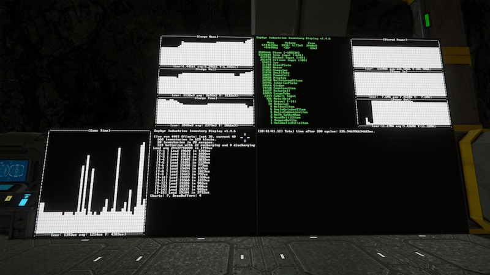
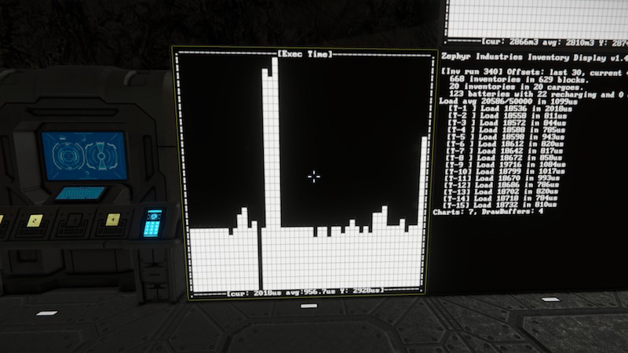
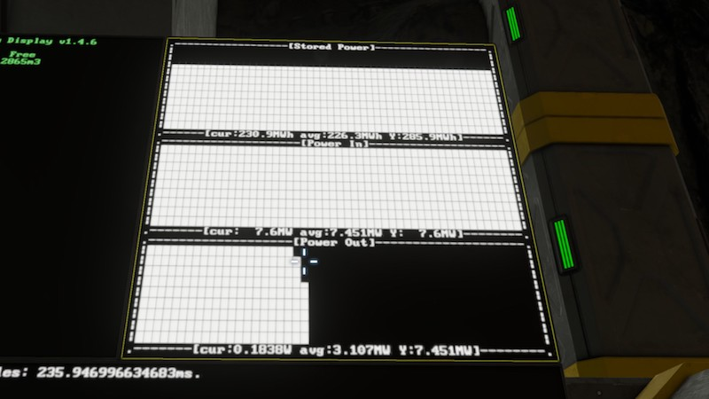
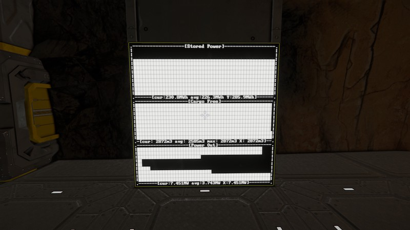

# space-engineers-zi-bar-charts
Space Engineers - Zephyr Industries Bar Charts



## Warning:

Zephyr Industries Bar Charts is functional but not particularly user-friendly at this stage. There isn't a great deal of documentation without looking at the source code for the script. If you're interested in learning how to write your own scripts, it's probably got some intermediate-level ideas in there for you to be inspired by.

## Living in the Future(tm)

*Ever wanted to see your entire bases's inventory at a glance? To see pretty charts of how your power demand has fluctuated over time?*

Zephyr Industries has what you need, I'm here to tell you about their great new product: _Zephyr Industries Bar Charts_.

Display sorted lists of your base inventory contents! Display bar charts of power supply, demand, and storage or of cargo capacity, usage, and free space. Display multiple charts on one LCD panel!

Life has never been so good, that's what Living in the Future(tm) means!

Small print: Zephyr Industries Bar Charts doesn't include charts to do any of the above, it merely provides the capability to display a time series of datapoints to other scripts. Only included charts are those charting performance of the script itself. Prolonged usage may also cause kidney damage.

## Instructions:
* Place on a Programmable Block.
* The script will run automatically every 100 game updates, and scan for updates to your base every 300 game updates (~30-60 seconds).
* Mark LCD panels by adding a tag to their name and on the next base scan the script will start using it.
  * `@ChartDebugDisplay` displays info useful for script development, including performance.
  * `@ChartWarningDisplay` displays any issues the script encountered.
  * `@ChartDisplay` will configure the display for charts. Configuration is a bit more complicated, see the *Chart Displays* section for more details.

## Chart Displays:

To configure a chart display you need tag the name with `@ChartDisplay` and to edit the Custom Data for the display.

The Custom Data follows an INI-file format with section names indicating what chart you'd like to display and section keys adding extra parameters to the chart.

Some examples are probably a bit easier to understand. These examples use datasets provided by Zephyr Industries Inventory Display.

### Basic Execution Time Chart

FIXME: update screenshots.



Set the Custom Data to:

```
[Chart Exec Time]
```

This creates one chart tracking the `time` series for script execution time, with the default options: fill the entire panel, have the bars aligned vertically and time horizontal.

### Triple Power Chart



```
[Stored Power]
height=33

[Power In]
y=33
height=33

[Power Out]
y=66
height=33
```

This places three charts onto one display folowing the `power_stored`, `power_in` and `power_out` series. It also overrides the default layout so that they tile one above the other taking up about a third of the height of the panel each and the full width.

### Mixing It All Together



```
[Stored Power]
height=33

[Cargo Free]
y=33
height=33
horizontal=false
show_cur=false
show_max=true

[Power Out]
y=66
height=33
horizontal=false
```

Creates three charts on one display:

* The top chart is stored power, similar to the triple chart.
* The middle chart is free cargo space, with bars going horizontally. The current value is hidden from the legend, and the max value is shown.
* The bottom chart is tracking power leaving the batteries and other than being horizontal is a standard chart.

### List of chart series (FIXME: these are in ZI Inventory Display)

Series name | Default Unit | Description
:---: | :---: | :---
Stored Power | MWh | How much power is stored in your batteries.
Max Stored Power | MWh | How much power can be stored in your batteries.
Power In | MW | How much power is entering your batteries.
Power Out | MW | How much power is leaving your batteries.
Cargo Mass | t | How much mass of cargo is within all cargo containers.
Cargo Vol | m3 | How much volume is used within all cargo containers.
Cargo Free | m3 | How much volume is free within all cargo containers.
O2 Vol | m3 | How much volume is used within all oxygen tanks.
O2 Free | m3 | How much volume is free within all oxygen tanks.
H2 Vol | m3 | How much volume is used within all hydrogen tanks.
H2 Free | m3 | How much volume is free within all hydrogen tanks.
All Active Assemblers | - | How many assemblers (all types) are active.
All Assemblers | - | How many assemblers (all types) in total are available.
Active Assemblers | - | How many assemblers (full type) are active.
Assemblers | - | How many assemblers (full type) are available.
Active Basic Assemblers | - | How many basic assemblers are active.
Basic Assemblers | - | How many basic assemblers are available.
All Active Refineries | - | How many refineries (all types) are active.
All Refineries | - | How many refineries (all types) are available.
Active Refineries | - | How many refineries (full type) are active.
Refineries | - | How many refineries (full type) are available.
Active Basic Refineries | - | How many basic refineries are active.
Basic Refineries | - | How many basic refineries are available.
Active Survival Kits | - | How many survival kits are producing.
Survival Kits | - | How many survival kits are available.
Chart Exec Time | us | (debug) Microsecond timings of how long the script ran for on each invocation.
Chart Instr Load | - | (debug) Instruction count complexity load for each invocation of the script.

### List of chart options

Option | Default | Description
:---: | :---: | :---
surface | 0 | Name or number of the panel to display on if there are multiple panels on the block.
x | 0 | Panel horizontal percentage to start the chart at. 0 is left of the display.
y | 0 | Panel vertical percentage to start the chart at. 0 is top of the display.
width | 100 | Percent of the panel width to span.
height | 100 | Percent of the panel height to span.
chart | no value | If set it will be used for the chart series instead of the section name.
horizontal | true | If false, the chart time axis will run top to bottom rather than right to left.
flip_horizontal | false | If true will flip the chart left-to-right.
flip_vertical | false | If true will invert the chart vertically.
center_zero | false | If true will always center the zero axis in the display rather than have it dynamically move.
show_title | true | Should the chart title be displayed in the top border?
show_cur | true | Should the current series value be displayed in the bottom border?
show_avg | true | Should the average value of the displayed bars be shown?
show_max | false | Should the max value of the displayed bars be shown?
show_scale | true | Should the scale (max Y point) be displayed in the bottom border?
cur_label | cur: | Label to annotate the current value with.
avg_label | avg: | Label to annotate the average value with.
max_label | max: | Label to annotate the max value with.
scale_label | Y: or X: | Label to annotate the scale value with.
title | chart name | Title to display for the chart.
unit | varies | Unit to use for display. (Note: Doesn't change chart scaling, just the unit label.)
scaling | 1.0 | How much to scale values by for display. Use 1000 to turn kg into tonnes. Or 0.0001 to turn tonnes into kg. Use `unit` to set the unit label.
bars | 30 | Number of bars to display in the chart. Max is 100.
warn_above | Not Set | If set, colour bars with value higher than this in red (or bad_color if set). Bars below will be green (or good_color if set).
warn_below | Not Set | If set, colour bars with value lower than this in red (or bad_color if set). Bars above will be green (or good_color if set).
fg_color | #D0D0D0 | Hex value for the foreground colour.
bg_color | #000000 | Hex value for the background colour.
good_color | #00D000 | Hex value for highlighting "good" values.
bad_color | #D00000 | Hex value for highlighting "bad" values.
font | Monospace | Font to use for labels. I'd advise Monospace or Debug.
font_size | 1.0 | Size of font to use compared to default. 0.65 works well for large cockpit panels.
frame_padding | 24.0 | How much padding to put on frames. Make sure to leave room for labels: 24 is a good value for a size 1 font and 18 is good for a 0.65 font.

FIXME: (not currently true) The scale is automatically set by some heuristics that sorta make sense and seem to work for me.

The scale is currently set to the maximum value seen in the recorded chart history of the past 100 datapoints.

Since you can only use the same section name once, if you wish to display the same chart on multiple displays on the same block you'll have to create a section name of your own, and then use the `chart` setting to pick which chart to display:

```
[Inv Cargo Free]
surface = Top Left Display

[Inv Cargo Free 2]
surface = Bottom Right Display
chart = Inv Cargo Free
```

If you want to display the same chart multiple times on the same panel within the same block... that doesn't work right now. Sorry.

## Sending data to be charted

Passing data to Zephyr Industries Bar Charts is done by invoking the script with arguments to issue commands.

### Command examples

`create "Test Chart" "awe"` would create a new chart called "Test Chart" and set the units of measurement to be "awe". If "Test Chart" already existed, it would set the units to be "awe". Any display with `@ChartDisplay` in the name and with a `[Test Chart]` section would start displaying it once the next grid scan is triggered (every 30 seconds or so).

`add "Test Chart" 49.0` would create a new datapoint with value 49.0 in the chart "Test Chart". It would also advance the chart by one step.

## Sending data from other scripts

TODO: document this
```C#
GridTerminalSystem.GetBlocksOfType<IMyProgrammableBlock>(_chart_blocks, block => block.CustomName.Contains("Zephyr Industries Bar Charts"));
// Not sure running more than one instance is a smart idea, but you do you.
foreach (IMyProgrammableBlock chart_block in _chart_blocks) {
    _chart_blocks[i].TryRun("add \"Test Chart\" 5.6");
}
```

### List of chart commands

Command | Arguments | Description
:---: | :---: | :---
create | "chart title" "chart units" | Creates or updates a chart to have the given title and units.
add | "chart title" value | Creates a new datapoint in the series and advances the chart by one step. Values will be converted to doubles.

## Future plans

Sticking a list of future plans in a README is a sure-fire way of ensuring they never get done, but nevertheless:

* Spreading the load of writing charts across multiple updates rather than all charts in one batch. Somewhat complicated by the fact that charts can share displays and a refresh for each chart on a display is required when any one is written.

## Contributing:

Zephyr Industries Bar Charts is open source, under an MIT license. You can contribute to or copy the code at https://github.com/illusori/space-engineers-zi-bar-charts.
